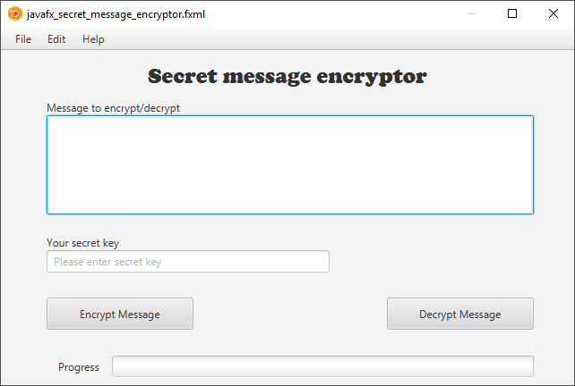

# Assignment - Secret Message Encryptor

Create a GUI application that can encrypt and decrypt secret messages based on a secret key.

Create an FXML GUI using Scene Builder similar to the one shown below. Be creative. Add a nice CSS stylesheet to style the application. You can use one from the Internet but you do need to provide the source from where you got it.

Next create an Encryptor class that has the following interface:

Build your own encryption. It does not really matter what algorithm you use. You can search the Internet but must program it yourself. You cannot use a library to do the actual encryption. Copy paste = 0.

Make sure to place the code inside its own project directory. Also fill in the [report.md](report.md) file. No report, no grades.

Make sure that the application compiles and runs without crashing.
